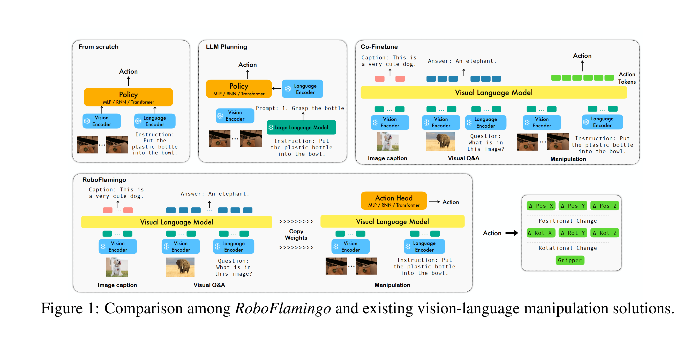
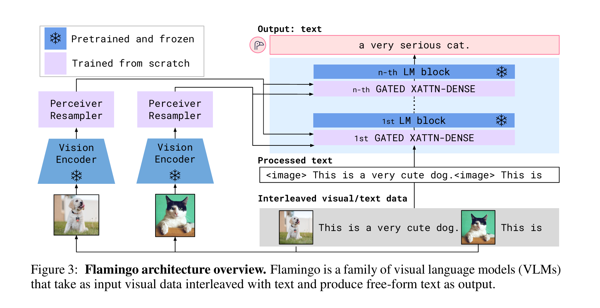
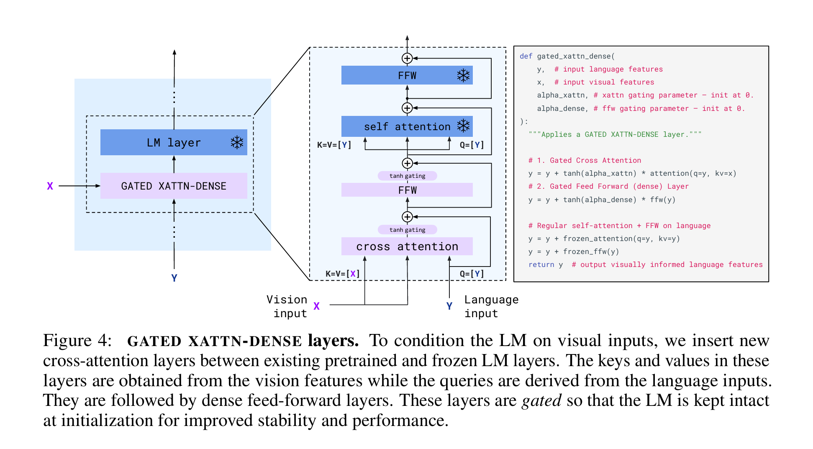
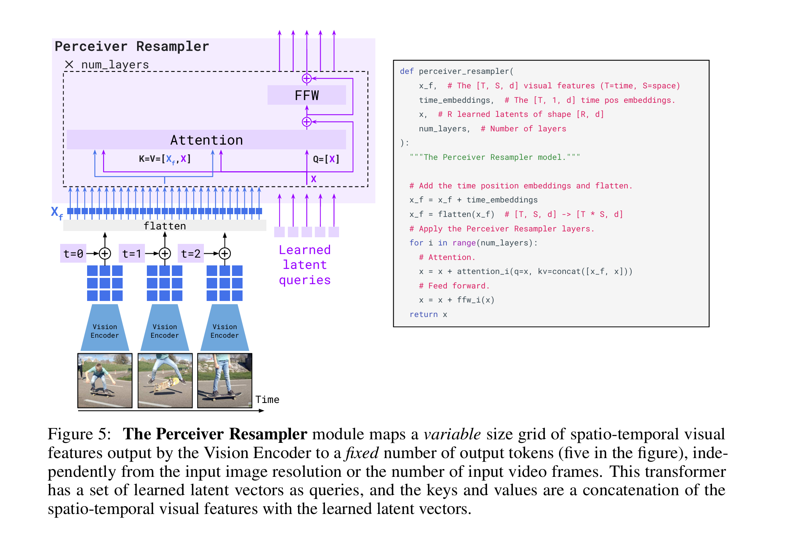
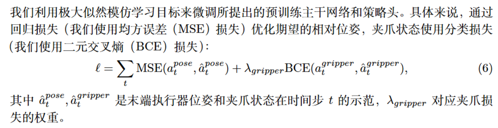

  

# RoboFlamingo

## 一、Motivation
这也是一个利用VLM在机器人数据集上微调的模型。据作者的说法是因为RT-2闭源且模型大，个人开发者难以微调,所以他们利用开源的openflamingo做了一个低成本的vla.
## 二、Methodology
为了降低RT-2那种模型的微调难度，作者没有采用RT-2那种将action也作为token对齐到语言和视觉模态空间的办法（因为这需要大量数据的微调），而是显式地用了一个policy head接受上游vlm融合以后的历史特征以输出动作。

事实上这和RT-1很像，并且这个方法在cv其他领域如分类分割中广泛地使用，就是用一个基础大模型抽特征，然后加一个head适配下游任务。
## 三、Architecture
### Flamingo
既然模型用的vlm是[flamingo](https://arxiv.org/pdf/2204.14198)，那我们就来回顾一下。

(感觉这三张图已经把架构展示得很清楚了)

### Policy Head
在此基础上，我们又设计了一个policy head，利用最后的视觉语言融合表征来输出动作。它解决了如下三个问题：
- 它将具有静态图像输入的视觉-语言模型适应为视频观测
- 它生成机器人控制信号而非仅文本输出
- 它需要有限的下游机器人操作数据，在拥有数十亿可训练参数的情况下实现高性能和泛化能力

policy head作者尝试了三种不同的架构：
- 纯MLP
- decoder-only transformer
- LSTM
最终的结果是LSTM最好
## 四、Loss

## 五、Some Comments
- 实验部分的几个baseline都是没有用预训练的vlm，这表明RoboFlamingo确实继承了预训练vlm的一些好处。
- 感觉这个工作就是把动作生成和vlm解耦了，减少了需要训练的参数量，其他似乎没啥特别令人眼前一亮的地方