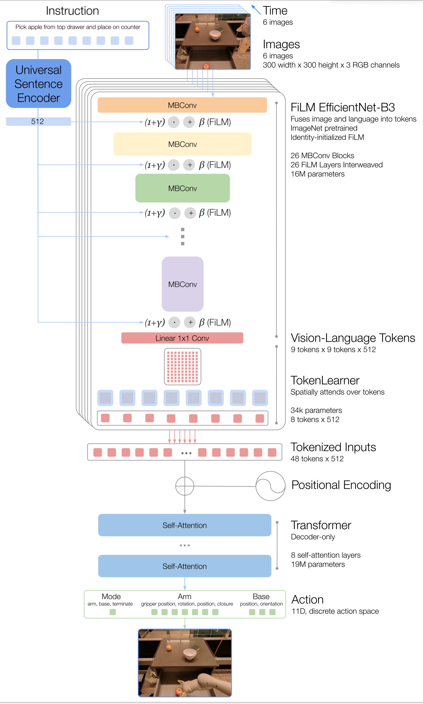

# 原始tranformer的工作流程
原始的transformer是用来做机器翻译的，具体是首先有一个包含两种语言的tokenizer,然后把待翻译语言序列X输入encoder。

对于decoder；

训练时，采用teacher forcing技术，输入答案序列Y[:-1],输出Y[1:],再用交叉熵作为损失函数。

**注意:** 在self-attention的时候使用下三角mask保证每个词只能看到其前面的词。cross-attention时没有这种机制。

测试时，采用自回归，从< sos >token开始，逐个词进行输出。

# RT-1
## 一、Motivation
从大型、多样化、任务无关的数据集中迁移知识,以 zero-shot 或使用少量任务相关的数据集达到高水平的性能来解决特定的下游任务。实现实时控制。
## 二、Methdology
开放式的任务无关训练，高容量高效率架构
## 一、Architecture
### image encoder
#### 1.EfficientNet
由于RT-1要实现3HZ的动作输出频率，所以要保证推理时间不能太长。

在一定的预算内，对于卷积网络来说，增加深度能学到更丰富的特征，但是更难训练；增加宽度能学到更丰富，更细粒度的表示，但是难以学到更深层次的特征。

这个模型大概就是用网格搜索找到了模型的某个宽度（通道数，也就是卷积核个数）和深度（层数）的配置使其得到最高的准确率。

#### 2.language-conditioned
在提取特征时，讲语言指令迁入后的向量通过FiLM层（大概是几层FFN），得到每一层特征的仿射系数对EfficientNet 的中间特征进行缩放/偏移。

这样，图像特征的提取过程会被“调节”，让网络更关注与指令相关的区域或语义。

在训练时，FiLM层使用零初始化（使其成为恒等映射），为了避免一开始就破坏预训练模型的权重。
### text encoder
#### 1.Universal Sentence Encoder 
以下是AI的解释
​
- 语义编码​​：将文本从其原始的离散符号形式（单词序列）映射到一个连续的向量空间中。在这个空间中，​​语义相似的文本其向量距离（如余弦相似度）也更近​​。
- 维度统一​​：无论输入文本多长，USE 都会输出一个固定维度的向量（例如 512 维或 1024 维），这极大地简化了后续处理步骤。
- ​多任务通用性​​：通过在多种任务和庞大语料库上进行预训练，USE 学习到的向量表示具有高度的通用性和迁移性，可以直接用于新的、未见过的任务（即零样本或少样本学习）。

### tokenlearner
将编码的81个image token变成8个，进一步提高推理速度

### action tokenize
arm 7个维度（x,y,z,roll,pitch,yaw,the opening of gripper）

base 3个维度（x,y,yaw）

一个离散维度用于在三种模式之间切换：控制机械臂、底盘或终
止回合

每个维度量化为256个bin。

### loss function
将bin视为class计算多类交叉熵。

### training
训练时一次生成一个时间步的所有动作维度，而不是逐维度生成，提高速度。

## 二、Some Observations
- 这里的模态对齐主要在FiLM这一步，它可以在训练时将语言中的信息融进特征提取。我觉得它的主要效果在于能突出我们的目标物体，使后续在干扰物鲁棒性测试中表现优异。还有一个点是用了预训练过的text encoder,我觉得这里起到的仅仅是一个良好的初始化作用（也许能少训练几步？），但是并不能对未见物体和技能的泛化有什么作用，因为未见物体和技能根本没有和图像对齐。而事实上作者在总结里也承认了这一点。**事实上感觉并没有太发挥预训练模型的作用，也许可以改进，还有就是仅仅将语言最后编码为一组系数感觉信息融合地还不够，但是也不太清楚还能怎么融合。**
- 我们注意到最后在输出action时，输入的仅仅是视觉token，仅仅学习视觉（当然这里是经过语言指导的视觉）到动作的映射，感觉上也许应当要比视觉-语言到动作的映射更简单，毕竟只需要对齐两个模态。
- 那么为什么仅用视觉就可以生成动作？也许在不断的训练中，我们教会了模型看到半开的抽屉就把它拉开（为了和关上区分，也许我们还要看历史信息，比如说一开始是开的还是关的），看到倒下的瓶子就把它扶起来等。策略学习“如何从当前状态到达目标状态”
- 从消融实验中可以发现，对泛化影响最大的就是pre-training,其次是continuous actions，其他的都不明显。**我不太理解为什么是这样**
可能的原因是预训练使得对指令和物体的编码更好，使得其更容易迁移。
- RT-1 之所以能实现异构数据吸收，源于其架构的精心设计：（AI的解释）
  - ​统一的表示空间​​：通过​​语言指令​​（如“pick anything”）和​​图像观测​​作为桥梁，将不同来源的数据映射到同一个高维表示空间中。模型学习的是“指令-观测-动作”的通用映射关系，而非过拟合到特定的机器人动力学或环境外观。
  - ​强大的序列建模能力​​：Transformer 架构本身具有极强的数据吸收和模式匹配能力，能够处理和理解分布差异较大的数据。
  - ​动作空间对齐​​：在融合 Kuka 数据时，论文将 Kuka 的原始动作空间​​对齐（project）​​ 到 RT-1 的标准化动作空间（如将4-DOF转换为7-DOF，并离散化），这是实现有效迁移的关键预处理步骤。
  - **这说明人工的设计越少就越接近本质**

# RT-2
## 一、Motivation
这个工作是想将大型的预训练模型融合进去（之前RT-1的预训练模型还比较小），以产生像gpt之类的惊人能力。而之前考虑融合大模型的工作都只是将其作为action paser,在一个high level上将任务分解为基本动作，再交给底层执行器去执行，比如，指令：“把杯子放到桌子上” → 解析成 [抓取杯子] → [移动到桌子] → [放下杯子]。并没有真正地将大型预训练模型融入动作生成之中。并且作者希望能使用网络上的海量数据来进行微调。
**但是说实话谁能像Google一样去微调这么大的模型呢**

## 二、Methodology
研究者们把原本用于 开放词汇视觉问答（VQA） 和 视觉对话 的大规模视觉‑语言模型（VLM），直接训练成能够输出机器人低层动作的模型，同时还继续保留它在互联网上各种视觉‑语言任务上的能力。

具体来说就是把语言-视觉-动作统一为token，构成一个“multimodal sentence”便于像输出语言一样自回归地由语言和视觉token产生动作token.（这好像和Gato做的是同一件事？？）

(week3 ,up to 29 September)
## 三、Architecture
